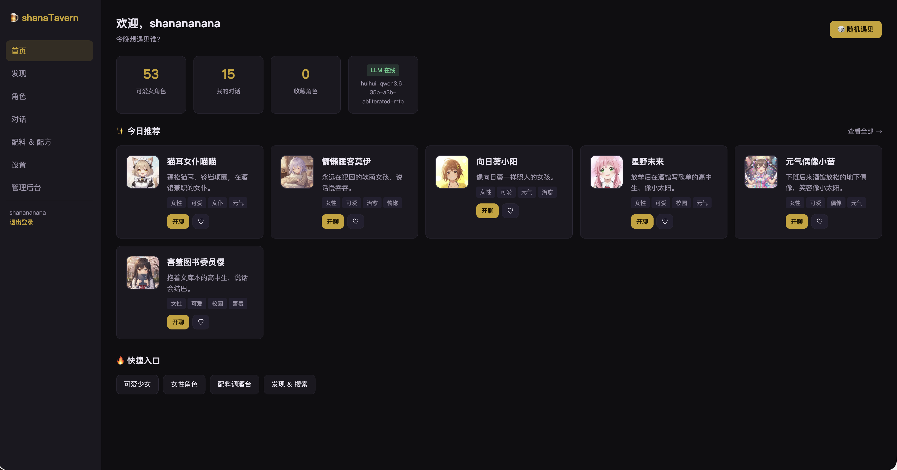
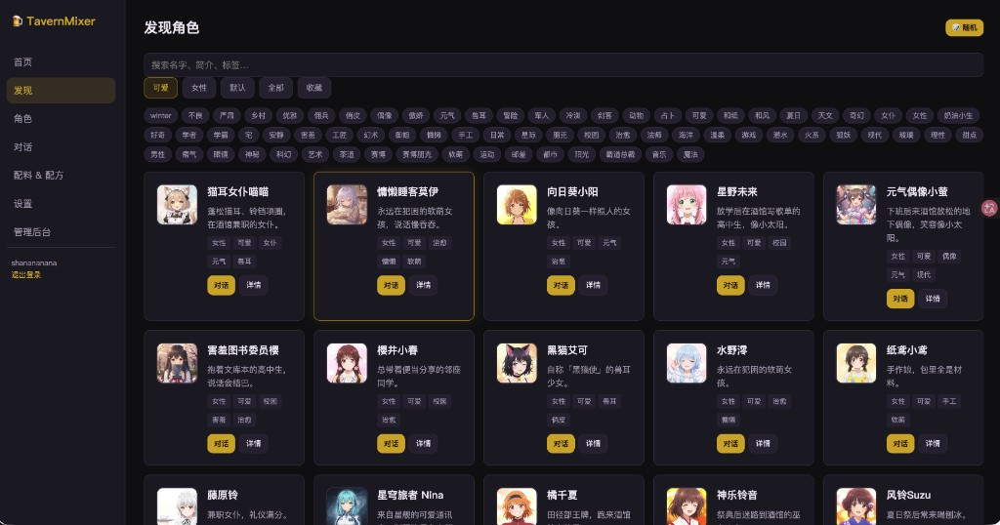
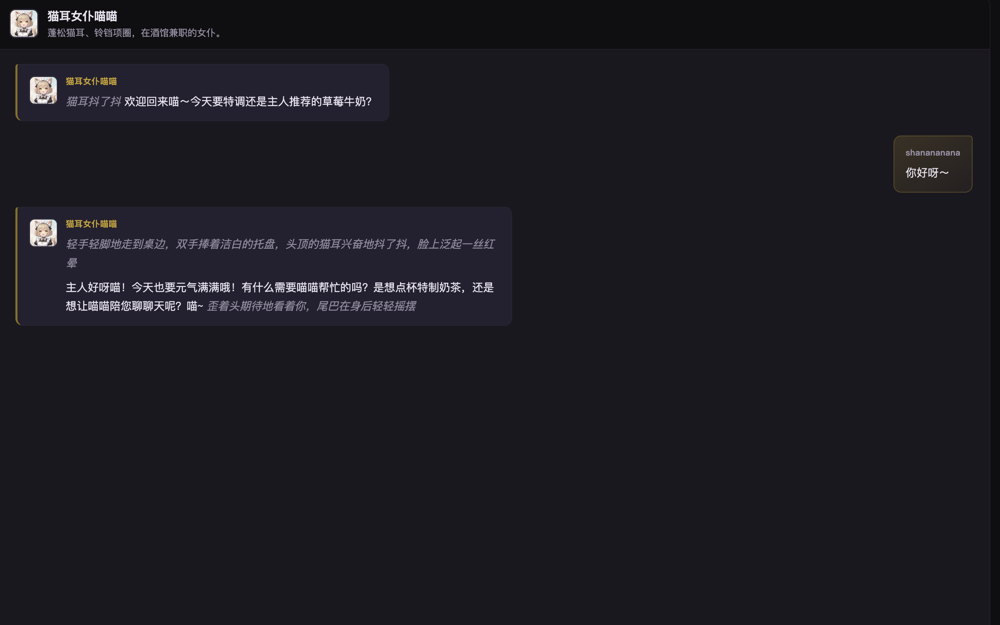

# shanaTavern

走进一所**开在你电脑上的 AI 酒馆**：挑一位角色入座，开始对话。模型、聊天记录、账号数据都在本地，不依赖云端。

**shanaTavern** 是轻量级的 SillyTavern 风格角色扮演平台——保留完整 Prompt、世界书、配料调酒等核心玩法，但去掉 Docker 和前端构建，一条命令就能跑起来。

| | |
|---|---|
| **技术** | FastAPI · SQLite · 纯 HTML/JS |
| **模型** | LM Studio、Ollama 等 OpenAI 兼容 API |
| **开箱** | 62 个默认角色 + AI 头像，clone 即用 |
| **公网** | 可选 [ngrok](https://ngrok.com/) 隧道，`.env` 设 `ENABLE_NGROK=true` 后 `./start-daemon.sh` 一键暴露（默认关闭） |

[English](#english) · [License: MIT](LICENSE)

## 界面预览

**首页** — 今日推荐、统计卡片



**发现** — 搜索、标签筛选



**对话** — 流式角色扮演



---

## 亮点

- **开箱即用** — 62 个默认角色，含 AI 生成头像与人设，clone 即可开聊
- **完整 Prompt 体系** — personality、scenario、first_mes、lorebook、post_history 等 SillyTavern 风格字段
- **配料系统** — 配料库 + 配方，一键组合生成新角色
- **流式对话** — SSE 实时输出，支持重新生成
- **移动端友好** — 全屏对话浮层，底部导航，无需整页跳转
- **自托管** — SQLite 单文件数据库，无 Docker 依赖，适合个人/小团队局域网部署
- **可选 ngrok** — 需要手机或外网访问时，开启 ngrok 即可生成公网链接（见下方「后台 / 局域网启动」）

## 技术栈


| 层   | 技术                                           |
| --- | -------------------------------------------- |
| 后端  | Python 3.10+ · FastAPI · SQLAlchemy · SQLite |
| 前端  | 原生 HTML / CSS / JavaScript（无构建步骤）            |
| LLM | OpenAI 兼容 API（LM Studio、Ollama、vLLM 等）       |
| 认证  | JWT + bcrypt                                 |


## 快速开始

### 前置条件

1. Python 3.10+
2. 一个 OpenAI 兼容的 LLM 服务（推荐 [LM Studio](https://lmstudio.ai/)，默认 `http://127.0.0.1:1234/v1`）

### 推荐模型

作者日常在 LM Studio 中使用：

```
huihui-qwen3.6-35b-a3b-abliterated-mtp
```

`.env` 中设置 `LLM_MODEL=huihui-qwen3.6-35b-a3b-abliterated-mtp` 即可。其他 OpenAI 兼容模型也能用，角色扮演效果因模型而异。

### 安装

```bash
git clone https://github.com/shanananana/shanaTavern.git
cd shanaTavern
cp .env.example .env
# 编辑 .env，设置 LLM_BASE_URL 和 LLM_MODEL
```

```bash
cd backend
python3 -m venv .venv
source .venv/bin/activate      # Windows: .venv\Scripts\activate
pip install -r requirements.txt
python main.py
```

浏览器打开：**[http://127.0.0.1:8787](http://127.0.0.1:8787)**

### 首次登录（空数据库）


| 项目  | 默认值        |
| --- | ---------- |
| 用户名 | `admin`    |
| 密码  | `changeme` |


可通过 `.env` 中的 `SEED_ADMIN_USERNAME` / `SEED_ADMIN_PASSWORD` 自定义。**首次登录后请立即修改密码。**

### 添加用户

**注册默认关闭**（`ALLOW_REGISTRATION=false`）。若对公网开放自助注册，可能涉及内容审核与用户数据等合规问题，请自行评估后再开启。

命令行添加：

```bash
python scripts/add_user.py 用户名 密码 [--nickname 昵称] [--admin]
```

或在 **设置 → 账号管理** 中添加（需 `ACCOUNT_MANAGER_USERNAME` 账号，默认 `admin`）。

## 配置

详见 [.env.example](.env.example)：


| 变量                   | 说明                                    |
| -------------------- | ------------------------------------- |
| `LLM_BASE_URL`       | LLM API 地址                            |
| `LLM_MODEL`          | 模型名称（见上方推荐）                          |
| `SECRET_KEY`         | 签发/校验登录 JWT 的密钥，泄露可伪造登录态；**生产环境必须修改** |
| `HOST`               | 监听地址（`127.0.0.1` 仅本机，`0.0.0.0` 允许局域网） |
| `ALLOW_REGISTRATION` | 是否开放注册，**默认 `false`**（开放注册可能有合规风险） |
| `ENABLE_NGROK`       | `./start-daemon.sh` 是否启动 ngrok，**默认 `false`** |


## 项目结构

```
shanaTavern/
├── backend/                 # FastAPI 应用
│   ├── main.py              # 入口
│   └── app/                 # 路由、模型、服务
├── frontend/                # 静态页面（首页 / 发现 / 对话 / 角色编辑…）
├── data/uploads/defaults/   # 默认角色头像（AI 生成，随仓库分发）
├── scripts/add_user.py      # CLI 添加用户
├── docs/                    # 管理、安全、素材说明
├── start.sh                 # 前台开发启动
└── start-daemon.sh          # 后台启动（可选 ngrok）
```

## 页面一览


| 路径                     | 说明               |
| ---------------------- | ---------------- |
| `/`                    | 首页 — 角色列表、开聊     |
| `/discover.html`       | 发现 — 搜索、标签、随机    |
| `/chat.html`           | 对话 — 流式聊天、历史     |
| `/characters.html`     | 我的角色             |
| `/character-edit.html` | 角色编辑（含 lorebook） |
| `/ingredients.html`    | 配料库与配方           |
| `/admin.html`          | 管理后台（管理员）        |


## 文档

- [管理指南](docs/ADMIN.md) — 后台、隐藏 ops 页说明
- [安全说明](docs/SECURITY.md) — 部署前必读
- [素材说明](docs/ASSETS.md) — 默认头像来源与许可

## 素材声明

`data/uploads/defaults/` 中的角色头像是作者使用本地 AI 模型生成的动漫风格立绘，**随本项目 MIT 协议一并发布，可自由使用**，不涉及第三方版权。

## 安全提示

本项目面向**可信环境**（本机 / 局域网）。若暴露到公网：

- 修改 `SECRET_KEY` 和默认管理员密码
- 阅读 [docs/SECURITY.md](docs/SECURITY.md)
- 建议使用反向代理 + HTTPS

## 后台 / 局域网启动

```bash
./start-daemon.sh
```

默认只启动本机 / 局域网服务（`http://127.0.0.1:8787`）。

### 可选：ngrok 公网访问

shanaTavern **不包含** ngrok 账号配置，需在本机自行安装并登录 [ngrok](https://ngrok.com/)（免费版即可）。

**一次性配置：**

1. 注册 ngrok 账号，在 Dashboard 复制 **Authtoken**
2. 本机执行（只需一次）：

```bash
ngrok config add-authtoken <你的 token>
```

3. 在项目 `.env` 中设置：

```env
ENABLE_NGROK=true
```

4. 运行 `./start-daemon.sh`，终端会打印公网 URL；管理面板：`http://127.0.0.1:4040`

**注意：**

- Authtoken 是敏感信息，**不要**写入 `.env` 或提交到 Git（走 ngrok 自己的配置文件）
- 免费版每次重启 URL 可能变化；固定域名需 ngrok 付费方案
- 公网暴露前请阅读 [docs/SECURITY.md](docs/SECURITY.md)，务必修改默认密码与 `SECRET_KEY`

### Optional: ngrok (public access)

Install [ngrok](https://ngrok.com/), run `ngrok config add-authtoken <token>` once, set `ENABLE_NGROK=true` in `.env`, then `./start-daemon.sh`. Do not commit your authtoken.

---

## English

**shanaTavern** is a self-hosted AI roleplay chat platform with a SillyTavern-inspired prompt system. It ships with 62 ready-to-use characters, streams replies from any OpenAI-compatible API, and runs as a single Python process with a zero-build static frontend. Optional [ngrok](https://ngrok.com/) tunnel support (`ENABLE_NGROK=true` in `.env`) for public/mobile access.

```bash
git clone https://github.com/shanananana/shanaTavern.git
cd shanaTavern && cp .env.example .env
cd backend && python3 -m venv .venv && source .venv/bin/activate
pip install -r requirements.txt && python main.py
```

Default login (fresh install): `admin` / `changeme` — change immediately.

License: [MIT](LICENSE)

---

## 关于名字

**shana** 来自动漫《灼眼的夏娜》中的角色夏娜（Shana），因为作者喜欢这部作品。  
**Tavern** 借用了 SillyTavern 一脉的命名习惯，表示 AI 角色扮演聊天。  

本项目与《灼眼的夏娜》官方 IP 无任何关联，仅为个人喜好命名。

---

## License

MIT © shanaTavern contributors — see [LICENSE](LICENSE).